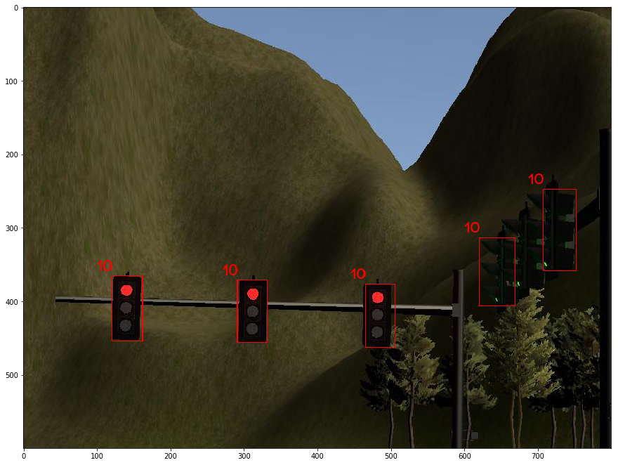
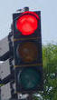
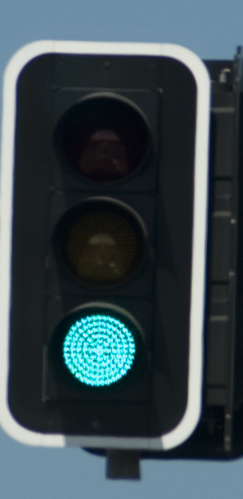
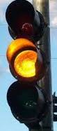
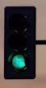

This is the project repo for the final project of the Udacity Self-Driving Car Nanodegree: Programming a Real Self-Driving Car. For more information about the project, see the project introduction [here](https://classroom.udacity.com/nanodegrees/nd013/parts/6047fe34-d93c-4f50-8336-b70ef10cb4b2/modules/e1a23b06-329a-4684-a717-ad476f0d8dff/lessons/462c933d-9f24-42d3-8bdc-a08a5fc866e4/concepts/5ab4b122-83e6-436d-850f-9f4d26627fd9).

### System Info
  * Ubuntu 16.04 - 64bit
  * Processor : Intel Core i7 CPU @ 2.8GHz * 8
  * Memory : 15.5 GB
  * Disk: 44 GB
  * [ROS Kinetic](http://wiki.ros.org/kinetic/Installation/Ubuntu)

## Design and Strategy

### Waypoint Updater Node 
  * Finds the 200 waypoints ahead and set their velocities to max_speed and publishes these waypoints to /final_waypoints
  * If red light flag is active I decide to reduce target speed according to their distance from the light to avoid exceeding acceleration limit exceed 10 m/s^2 and jerk limit 10 m/s^3. 
 
### Twist Controller Node
  * dbw_node starts a loop od 50Hz  to adjust vehciles throttle, steer and brake in each cycle as long as dbw_node is enabled
  * Throttle: I used a PID controller with KP=5.0, KI=0.0 , KD= 0.5 and limit the acceleration within the range of (decel_limit, accel_limit) from launch files parameter
  * Handling lights
  * Steer: I used a YawController based on wheel_base, steer_ratio, min_speed, max_lat_accel and max_steer_angle
  * brake: brake is 0 by defaul unless one of these cases happen:
    * red light: apply brake with intensity relative to the distance from the light, like if it's less than 15m apply full_brake and if it's more brake with a lower value, I calculated full_brake based on `(vehicle_mass + fuel_capacity * GAS_DENSITY )* acceleration * wheel_radius`
    * yellow light: apply a soft brake with intensity of 10.
    * if there are less than 200 waypoints ahead prepare to stop the vehicle by applying brake
  
  * How I tested twist_controller stop/move 
    *  Turning Camera on slows down the simulator significanlty which causes a lag between ros sending a command and cimulator receiving the command. 
    * Due to the high cpu uage with active camera, simulator tends to go off lanes and exceed speed limit which I think is caused by latency in receiving a response from ros
    * Just for testing purposes, I disabled camera and defined a 15 sec. loop over random color changes (Red,Green,Yellow) to test how my controller is handling the situation and is adjusting throttle, brake & steer, here is the snippet for testing:
    
    ```
    #----------------------------------------------------------
    #---------- Possible scenarios ----------------------------
    #----------------------------------------------------------
    # Note: Becuase the simulator preformance slows down with camera 
    #       I had to test my traffic_light handling code with following scenarios:
    #       1- set light to red for 10 seconds : vehicle should slow down and apply brake to full stop
    #       2- the set light to green: vehicle should start moving without exceeding max acceleration
    #       3- then set light to yellow: vehicle should apply soft brake (~10) to slow down vehicle
    #       4- repeat from the top
    delay = 15.0
    target_velocity_linear.x = 10
    if self._test_timer is None:
        self._test_timer = current_time + delay
        self._test_light_state  =0

    distance_to_light = 50
    light_state = self._test_light_state 

    if current_time > self._test_timer :
        if self._test_light_state == 0:
            self._test_light_state = 2
        elif self._test_light_state == 2:
            self._test_light_state = 1
        elif self._test_light_state == 1:
            self._test_light_state = 0

        light_state = self._test_light_state
        self._test_timer = current_time + delay

    ```


### Traffic Light Detector Node

> IMPORTANT CHANGES:  
> * /traffic_waypoint : I publish any detected traffic waypoint to this topic to handle moving/slowing/stopping the vehicle in waypoint_updater and dbw_node. (Original code was only publishing red traffic light)
> * /traffic_light_state: new topic that I added to identify traffic color state

#### Traffic Light Classification Algorithm:
 * Dataset: Model is trained on Bosch Small Traffic Lights Dataset, only on the cropped traffic lights.
  Train/Validation set 5440 images with 20% split.
  
  Here are some samples from Bosch Dataset, red regions are the cropped and store in a saparate dataset for training the model:
  
  <table style="width:100%">
   <tr>
     <td></td>
     <td></td>
   </tr>
  </table>
  
  
  * SSD: The first step in classifying the traffic lights is finding them in the whole screen, for doing so I used pretrained ssd network from [tensorflow model zoo](https://github.com/tensorflow/models/blob/master/research/object_detection/g3doc/detection_model_zoo.md) and filtered the output boxes to traffic_lights only. After detecting the boxes containing traffic light it's ready to pass to the model (next step).
  
  SSD results on finding traffic lights on the screen, index 10 shows the traffic_light label.
  <table style="width:100%">
   <tr>
     <td>Full Image</td>
     <td>Cropped Traffic Light</td>
   </tr>
   <tr>
     <td></td>
     <td></td>
   </tr>
  </table>
  
  * Model: I used a simple [Lenet5](http://yann.lecun.com/exdb/publis/pdf/lecun-01a.pdf) CNN model:
     * 2 convolutional layers 5x5x6 & 5x5x16 
     * 2 fully connected layers 120, 84 .
     * input layer 64x64x3
     * output layer 3 nodes : Red (0), Yellow(1), Green(2)
     * Epochs 10 (after a few experiments , 10 epochs produced the best results)
     * val_loss: 0.1715 - val_acc: 0.977
     * Find my epxeriments [here](https://github.com/chocolateHszd/Capstone_Project/tree/master/ros/src/tl_detector/light_classification/traffic_light_classifier)
      
  
     * Here are model outputs for some random traffic light images and their top 3 predictions:
     <table>
     <tr>
      <td><div>Pred 1: Red 100.000%</div><div>Pred 2: Green 0.000%</div><div>Pred 3: Yellow 0.000% </div></td>
      <td><div>Pred 1: Green 100.000%</div><div>Pred 2: Red 0.000%</div><div>Pred 3: Yellow 0.000% </div></td>
      <td><div>Pred 1: Yellow 99.899%</div><div>Pred 2: Green 0.062%</div><div>Pred 3: Red 0.039% </div></td>
      <td><div>Pred 1: Green 100.000%</div><div>Pred 2: Red 0.000%</div><div>Pred 3: Yellow 0.000% </div></td>
     </tr>
     <tr>
       <td></td>
       <td></td>
       <td></td>
       <td></td>
     </tr>
    </table>
  * Rosbag Testing
  
  ``` shell command
  $ roslaunch launch/site.launch
  $ rosbag play -l just_traffic_light.bag
  ```
  
  ```
  Some of the printed logs from rosbag testing:
  ...
  [INFO] [1513556638.282130]: class UNKNOWN
  [INFO] [1513556638.438032]: class UNKNOWN
  [INFO] [1513556638.602744]: class RED
  [INFO] [1513556638.769951]: class RED
  [INFO] [1513556638.933516]: class RED
  [INFO] [1513556639.100313]: class RED
  ....
  [INFO] [1513560627.324544]: class YELLOW
  [INFO] [1513560627.491169]: class YELLOW
  [INFO] [1513560627.657733]: class YELLOW
  [INFO] [1513560627.825298]: class YELLOW
  ...
  [INFO] [1513556648.768566]: class GREEN
  [INFO] [1513556648.933310]: class GREEN
  [INFO] [1513556649.097478]: class GREEN
  [INFO] [1513556649.261926]: class GREEN
  [INFO] [1513556649.426090]: class GREEN
  ```
  
## Notes

 * Obstacles
 * Poor Camera Performance:
 * rivz Errors

