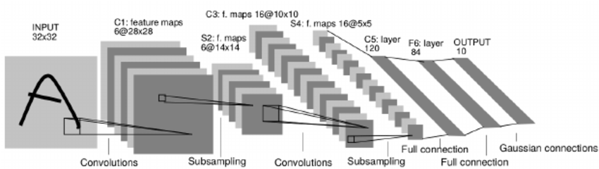
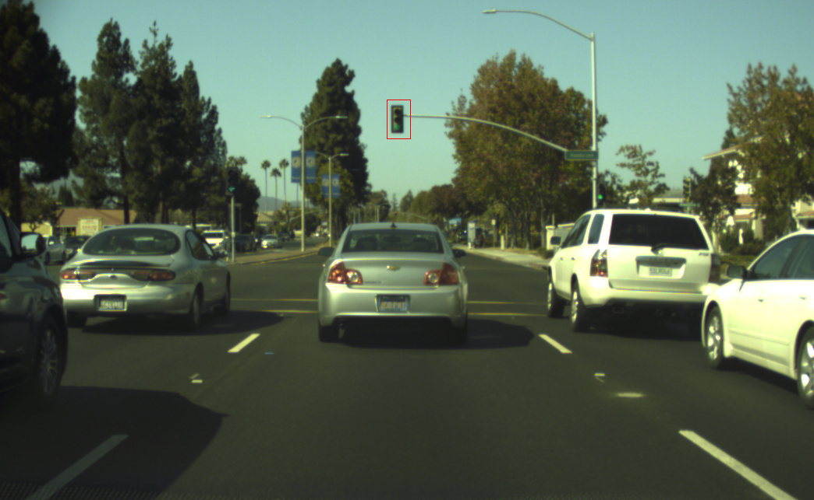

This is the project repo for the final project of the Udacity Self-Driving Car Nanodegree: Programming a Real Self-Driving Car. For more information about the project, see the project introduction [here](https://classroom.udacity.com/nanodegrees/nd013/parts/6047fe34-d93c-4f50-8336-b70ef10cb4b2/modules/e1a23b06-329a-4684-a717-ad476f0d8dff/lessons/462c933d-9f24-42d3-8bdc-a08a5fc866e4/concepts/5ab4b122-83e6-436d-850f-9f4d26627fd9).

### System Info
  * Ubuntu 16.04 - 64bit
  * Processor : Intel Core i7 CPU @ 2.8GHz * 8
  * Memory : 15.5 GB
  * Disk: 44 GB
  * [ROS Kinetic](http://wiki.ros.org/kinetic/Installation/Ubuntu) if you have Ubuntu 16.04.

## Design and Strategy

### Waypoint Updater Node 
  * Handling Velocities
  * Publishing waypoints ahead
 
### Twist Controller Node
  * Handling lights
  * How I tested my stop/move algorithm


### Traffic Light Detector Node
  * changes (Topics)
  * Dataset
  * SSD
#### Traffic Light Classification Algorithm:
  I used a simple [Lenet5](http://yann.lecun.com/exdb/publis/pdf/lecun-01a.pdf) CNN model:
  * 2 convolutional layers 5x5x6 & 5x5x16 
  * 2 fully connected layers 120, 84 .
  * input layer 64x64x3
  * output layer 3 nodes : Red (0), Yellow(1), Green(2)
  
  ##### Dataset 
  Model is trained on Bosch Small Traffic Lights Dataset, only on the cropped traffic lights.
  Train/Validation set 5440 images with 20% split.
  
  Here are some samples from traning set, red regions are the cropped and store in a saparete dataset:
  
  <table style="width:100%">
  <tr>
    <td></td>
    <td></td>
  </tr>
</table>
  
  * Some Images
  * Rosbag Testing
  
  ``` shell command
  $ roslaunch launch/site.launch
  $ rosbag play -l just_traffic_light.bag
  ```
  
  ```
  Some of the printed logs from rosbag testing:
  ...
  [INFO] [1513556638.282130]: class UNKNOWN
  [INFO] [1513556638.438032]: class UNKNOWN
  [INFO] [1513556638.602744]: class RED
  [INFO] [1513556638.769951]: class RED
  [INFO] [1513556638.933516]: class RED
  [INFO] [1513556639.100313]: class RED
  ....
  [INFO] [1513560627.324544]: class YELLOW
  [INFO] [1513560627.491169]: class YELLOW
  [INFO] [1513560627.657733]: class YELLOW
  [INFO] [1513560627.825298]: class YELLOW
  ...
  [INFO] [1513556648.768566]: class GREEN
  [INFO] [1513556648.933310]: class GREEN
  [INFO] [1513556649.097478]: class GREEN
  [INFO] [1513556649.261926]: class GREEN
  [INFO] [1513556649.426090]: class GREEN
  ```
  
## Notes
 * Obstacles
 * Poor Camera Performance:
 * rivz Errors

